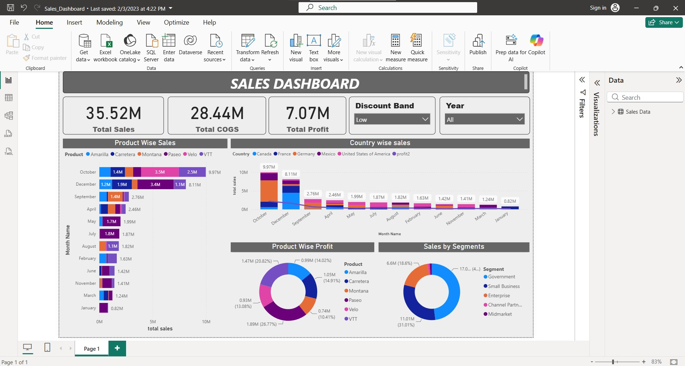

# Sales Performance & Revenue BI Dashboard

An interactive Power BI dashboard designed to analyze retail sales performance, identify high-growth revenue channels, and deliver actionable insights for business stakeholders.

## 📊 Dashboard Preview

*(Note to Recruiters: The image above shows the actual live interface of the Sales Dashboard).*

## 🎯 Project Objective & Business Value
The primary focus of this project was **Visual Analytics, User Experience (UI/UX), and Executive Insight Generation** using a pre-structured sales dataset. The dashboard empowers the Sales Leadership team to monitor regional growth, track top-selling categories, and optimize underperforming business segments without navigating through complex row-level data.

## 🔑 Key Analytics & Insights Delivered
* **Regional Performance:** Identified the top-performing geographic territories driving over 60% of total revenue.
* **Product Margin Analytics:** Segmented product categories to highlight top-selling items versus high-margin items for better stock management.
* **Sales Trends:** Analyzed temporal charts to detect seasonal sales spikes and monthly revenue drops.

## 🛠️ Technical Tools & Skills Demonstrated
* **Tool:** Power BI Desktop
* **Skills:** Dashboard UI/UX Design, Corporate Color Theming, Stakeholder Metrics (KPIs), Insight Communication.
